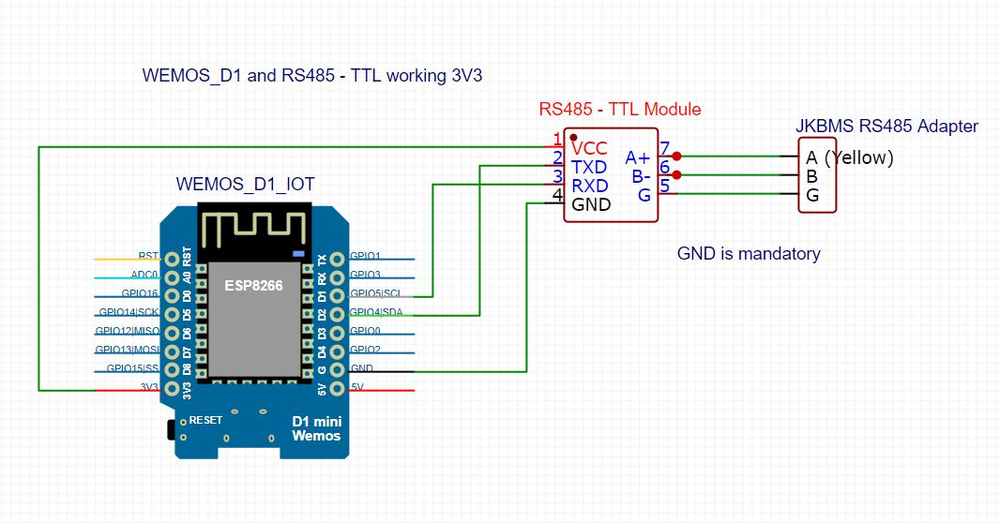
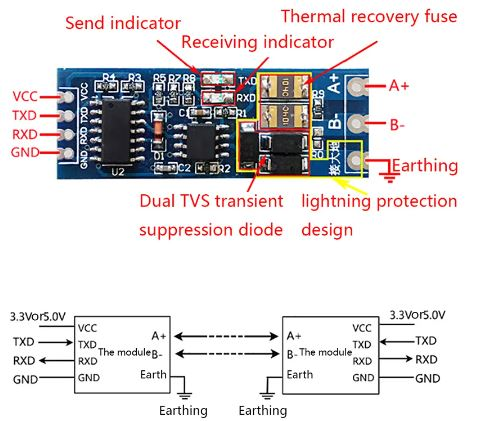
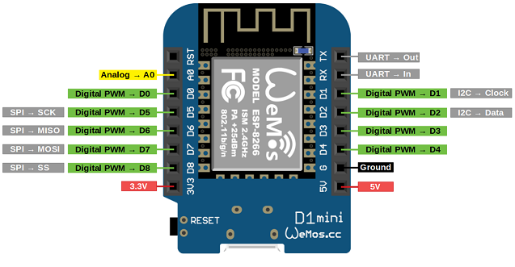

# JK-BMS Monitor using RS485-TTL

Arduino code used to read voltages of cells, cell count, remain capacity, charging current and pack voltage. This code used to monitor 8 cells of LiFEPo4, 24 Battery pack using JK-B1A8S20P

There are two files;
1. Read BMS data and WifiManager, Not required to hardcode Wifi credentials, WeMos module will be a AP at startup. Use mobile phone to connect and configure SSID and Password once connected to AP - this will apear as "Solar.JKBMS".
2. Read BMS data (include WifiManager code), BMS data will be publish to public MQTT broker.
In addition, it will monitor battery capacity and turn on/off a 30A 5VDC 230VAC Relay.

(Note: JK-BMS RS485 adapter GND and RS-485_TTL module GND need to connect to avoid data packet drop issues)

# Schematics 3.3V

# RS485 - TTL Module

`https://tronic.lk/product/xy-017-uart-ttl-to-rs485-3-3v-5v-module-for-arduino`

# WeMos Module

`https://tronic.lk/product/nodemcu-d1-mini-lua-wifi-wemos-4m-esp8266-module`

# JK-BMS RS485 adapter

## References

* https://github.com/dj-nitehawk/jk-bms-test
* https://github.com/dj-nitehawk/Hybrid-Inverter-Monitor
